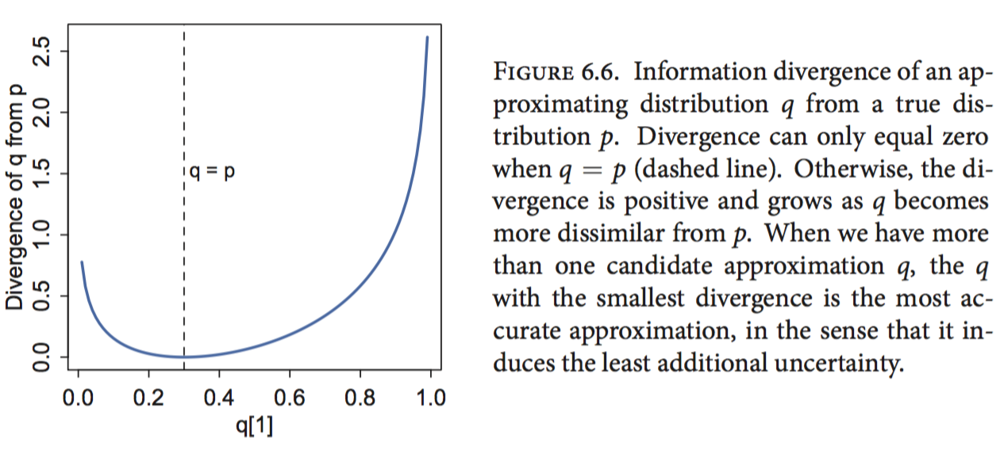

<script type="text/x-mathjax-config">
MathJax.Hub.Config({
  TeX: { equationNumbers: { autoNumber: "AMS" } }
});
</script>
[toc]

<div id="tags">Book</div>

# Statistical Rethinking 读书笔记

最近这个月断断续续读完了Statistical Rethinking一书，感觉这本书还是挺适合入门的。作者的文风很好，每一章开头都会引入一个有意思的例子方便读者对本章的内容有一个大概的理解，不过书中的代码部分主要用到了自己写的一个库，这么做有好处也有坏处，好处是整本书中代码部分会相当简洁，侧重理解概念而不拘泥于代码细节；不过坏处是对于我这种不太熟悉R代码的人来说有种雾里看花的感觉，整体上讲，作者对二者平衡得很好，即使没有R基础也能很好地理解大部分内容，只是练习部分会稍微吃力点，后面感觉自己还会重读这本书。

另外作者还录制了[教学视频](https://pan.baidu.com/s/1skZIvu9)，大致看了几课，感觉蛮不错，不过不如看书来得快。

以下是本书中的一些要点：

##Chapter 2
提纲挈领的一部分。作者用small worlds类比观测到的世界，而large worlds则对应真实世界，我们无法知道真实世界是怎样的，只能根据观测到的世界去修正我们的猜测，由此引出了先验、似然和后验的概念。这章最核心的是要理解quadratic approximation，作者用`map`函数对其作了封装，前面几章会频繁用到。

关于MAP、ML等有个很不错的[介绍材料](https://engineering.purdue.edu/kak/Tutorials/Trinity.pdf)可以参考。

##Chapter 3
理解HDPI的概念，可以尝试自己动手实现下这个函数，比我想象中要简单。可以参考下[这里](http://stackoverflow.com/questions/22284502/highest-posterior-density-region-and-central-credible-region)

##Chapter 4
重点理解高斯分布的内涵，这一点在PRML/MLAPP中也都有提到，思想是一致的。

##Chapter 5
从一元线性回归过度到多元线性回归的时候，会遇到几个典型的问题。变量之间存在相关性时，后验分析会出现不符合常识的问题。此外还分析了引入哑变量对类别变量进行编码的影响。

##Chapter 6
过拟合和欠拟合，一个经典问题。作者的出发点很新奇，从信息熵的角度出发，把交叉熵、KL散度、（样本内/样本外）偏差联系了起来，然后引入正则先验的概念。本章最关键的是信息准则，这对于我来说是个全新的概念，后面几章中都反复用到该指标进行模型比较和评估等。

信息熵的表示如下：
$$
\begin{equation}
H(p) = -\sum_{i=1}^{n}p_i log(p_i)
\label{entropy}
\end{equation}
$$
稍微改写下形式：
$$
\begin{equation}
H(p) = \mathbb{E}H(p_i)
\end{equation}
$$
其中$\mathbb{E}$表示求期望，$H(p_i)=log(\frac{1}{p_i})$，其含义是概率越低信息量越大，求log是为了保证相互独立事件的信息量之和等于这些事件同时发生的信息量。

> **K-L散度**：用一个分布去描述另一个分布时引入的不确定性。



$$
\begin{equation}
\begin{split}
D_{KL}(p,q) & = H(p,q) - H(p) \\
 & = -\sum_{i}p_i log(q_i)  - \left(- \sum_{i}p_i log(p_i) \right) \\
 & = - \sum_i p_i \left(log(q_i) - log(p_i) \right)
 \end{split}
\label{klexplained}
\end{equation}
$$

式子$\eqref{klexplained}$中的$H(p,q)$表示**交叉熵**。

关于KL散度，有一篇[博客](https://www.countbayesie.com/blog/2017/5/9/kullback-leibler-divergence-explained)写得更详细写，可以参考。

##Chapter 7

这一章重点分析了多个变量之间存在相互影响时的情况，感觉自己在做数据分析的时候，好像经常忽略了这点。

##Chapter 8

MCMC和HMC的解释很直观。关于采样链（Chain），有效采样个数等都有说明。
开篇提到的Good King的例子很好玩，我也重写了下：

```clojure
(def N 10)
(def counts (vec (range 1 (inc N))))

(defn move
  [i]
  (rand-nth [(mod (dec i) N)
             (mod (inc i) N)]))

(defn play
  [i]
  (let [j (move i)
        count-i (nth counts i)
        count-j (nth counts j)]
    (if (or (> count-j count-i)
            (<= (rand) (/ count-j count-i)))
      j i)))

(->> (iterate play (rand-int N))
     (take 100000)
     frequencies
     (sort-by first))
```

##Chapter 9

简单介绍了下广义线性模型，理解这里提到的两类连结函数(link function)，本质上是将参数从不同的值域映射到$[-\infty,+\infty]$，留意其中参数的可解释性。

后面几章中看得比较粗略，我主要看了下多层模型、零膨胀问题和缺失值的问题。
