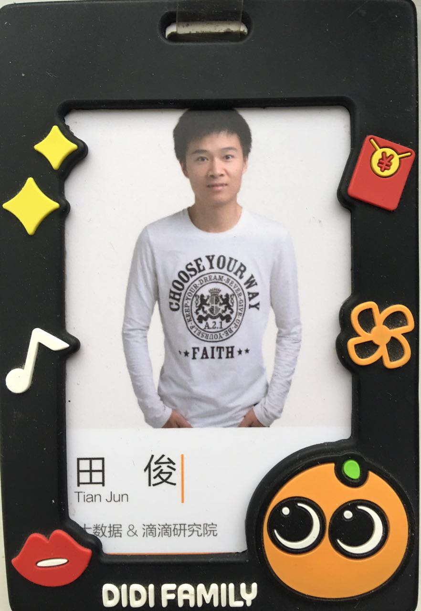

[toc]

Life

# 我在滴滴这一年

最终，还是决定离开这里。

## 当初为什么来这里呢？

> “......，当初为什么来这里呢？......”，决定离开前的一次谈话中，老大GPH[^shortcut note]这么问我。

我还记得是2015年7月的某天，XJX在微信上给我发了个拉勾网上的链接，说滴滴那边招算法方面的实习生，有兴趣可以试试。虽说在所里也没时间实习，不过心想着试试也无妨，就当为9月份的校招练练手好了。那时候，对滴滴的规模有多大其实并没有感觉，当然，对他们的技术也是一无所知。面试的地点在农大南路某个写字楼里，面试就俩人，其中一个人简单聊了聊简历，写了个算法题，推了下LR公式，然后问我最近在看什么机器学习方面的书？我说正在读ESL，PRML？这本倒没读，只是上课的时候读了部分MLAPP。然后他介绍了下自己的背景，清华毕业的，刚从HULU那边过来，这边机器学习相关的东西都才刚起步，以前的都是些规则系统，代码用C++，现在打算做些改造，很缺人手。不过我实习时间上没法满足，于是作罢。临走前问我，“后面校招的时候会考虑滴滴吗？”，按正常人的逻辑一般是不会直接拒绝吧，不过我那时回复的是，“大概不会考虑，感觉在滴滴这种小公司里没啥成长。”，呵呵呵，哪知后面啪啪啪打脸了。（一年后进了公司，我才知道当时面我的是GD，出于感谢，我在钉钉上跟他简单聊了下，哪知道人家对我根本没印象，sigh...）

中间校招面试的过程在[《聊聊最近》](http://www.tianjun.ml/essays/61)一文中有简单介绍，当时的想法是这样子的：

> 其实从内心来讲，自己倾向于往计算广告方向发展，商业价值更大一些，但这块需要一个好的成长环境。不过呢，觉得做nlp这块好像也还不错，把功底打扎实了以后做周边的东西都能跟得上，不过总觉得有那么一丝丝想法，是不是有必要读个博把这块的工作做得更深入呢？

当时对于继续做NLP有些犹豫，很重要的一点是，我看不清这块未来的发展方向，回到两年前，深度学习在NLP方向的应用有着井喷之势，但身处其中的时候，其实很难看到自己该往哪个方向发展，我很焦虑自己会一头扎到其中后难以再跳出来，也就没有准备读博（现在看来这种想法可能有些可笑）。而我对推荐和广告感兴趣的一个主要原因是，之前参加过一些比赛，觉得**挺有意思**（是的，兴趣占了很大因素），但是后来在和许多人沟通之后明确了一点，*这个方向大概不会有很大的突破性进展了*，更多的是工程性和技巧性在里面，算法相对成熟，而且即使有突破也能难形成壁垒，（当然，从个人学习的角度来讲，还是会很有收获的，只是总觉得少了点什么）。

就在我纠结的时候，面了滴滴，也顺利拿了offer，加上中间对滴滴要做的事情有了些许了解。那时刚成立滴滴研究院，LW也去我们所里做了演讲（搞笑的是院长没多久走了，LW后来也去了腾讯AILab），感觉滴滴这边也算是个机会。一方面，这里算法刚起步，是个学习和应用算法的试验田；另一方面，可以学习下快速成长期的公司，在工程方面是如何迭代和打磨的（这样的机会还是挺难得的，毕竟以后有的是机会去大公司里了解一些成熟的体系）。于是乎，来了滴滴~

## 这一年里都做了些啥？

> “你怎么评价自己过去这段时间的工作？”，年初公司薪资普调的时候，老大一对一私聊的时候这么问我。

回首这一年，很惭愧，对于团队只做了一些微小的工作（不是谦虚，而是事实）。虽然很多工作都很枯燥，像处理数据、服务开发与维护等，但自己也算是尽心尽力在做好自己的本职工作。所以当时我的回答是，“感觉自己工作量完成得一般，还可以做得更好！”。老大也表示了认同，然后鼓励我工作中多主动一些（其实我明白他的意思是，薪资上我已经尽力为你争取了，该加班的时候还是多加加班赶下进度......）。我对加班啥的其实没有那么大的反感（虽然我这一年加的班总共也不到一个星期），前提是得有值得这么做的事情啊......不过老大在这方面很open，从来没说过我什么。

那次谈话之后，断断续续做了些算法方面的探索和实践，然而方向多次调整，感觉有些累了，每次调整都让人觉得前面的努力都是徒劳（包括公司层面和个人层面）。在公司目前这个阶段，任何一个方向想要有较大的突破，都需要持续的耕耘和迭代，像这样反复调整，很伤士气。虽然自己的title是*算法工程师*，然而，这一年里与算法相关的工作少得可怜，质和量都有所停滞，主要靠业余的兴趣在支撑，不过工程方面的经验似乎有不少提升，有得有失吧。

## 再读《程序员修炼之道——从小工到专家》

> Programming isn’t hard!
> 
> Programming **well** is **very** hard!

这几天休息的日子里，我又读了一遍这本书，工作后再读，感触颇深，再过几年之后，我应该还会重读的。下面结合我的一些工作经历和书中的内容，简单聊几点。

### Provide Options, Don't Make Lame Excuses

刚开始工作的时候，给自己定的工作计划总是会有延期的情况发生，归结其原因，无非是中途有各种各样的琐事插入进来，于是会有各种各样的借口。后来慢慢意识到，本质上，这是一种极其不负责任的态度，既然承诺某件事定期完成，就应该同时考虑到各种风险因素，即便有某些意外发生，也需要尽量提供选择而不是找各种蹩脚的借口（不过我看组里这点似乎不太好，拿最近DSP项目而言，大家提供的选择就俩字：“加班”，这往往掩盖了背后的风险控制、对外的资源协调等一系列问题）。

### Don't Live with Broken Windows

老实说，这点没做到。好几次接手别人代码的时候，就已经是烂代码了，当然，也不是那么烂。拿补贴地图的代码为例，逻辑其实很清晰，定期读配置、聚合，然后解析请求、返回补贴信息，然而中间的配置解析写得很繁琐，字符串的拼接、时间越界判断等等都杂糅在一个函数中，以至于后来在其之上加入一些新功能的时候，心态就变成了，“唉，前面已经写这么烂了，新加的这个功能再怎么写好也都是徒劳的了，先草草修改下实现功能再说吧~”，砰~又一扇窗破了。等到临走前自己做代码交接的时候，我也成了烂代码的贡献者之一......(心疼交接的那哥们1s)

> “发现一个破窗户就修一个”

不过，代码如果一开始就是自己写的，情况又有些不一样了，毕竟没人愿意看着自己的代码一点点膨胀到无序状态。在写洋流那边的项目时，我都会尽量做好类和功能的抽象，review代码的时候也尽量会让代码风格保持一致。当然，实践中会遇到些问题，比如你没法让不熟悉Java8的人，强制用函数式风格，但总的来说，充分的沟通和交流是极其必要的。

### Stone Soup and Boiled Frogs

重读这一节的时候，有些伤感，因为团队的发展简直活生生地将“石头汤”的故事演绎成了另一个版本。

> 在石头汤的故事里有两层语义。士兵戏弄了村民，他们利用村民的好奇，从他们那里弄到了食物。但更重要的是，士兵充当催化剂，把村民团结起来，和他们一起做到了他们自己本来做不到的事情——一项协作的成果。最后每个人都是赢家。

和Uber中国合并后，老大带着大家从补贴转做调度（掏出了石头），依稀记得我们这帮村民那时候其实都是将信将疑的，既没有方向，也没有抓手。出于信任，慢慢地大家也就投入进来了（拿来了食材），然而和石头汤故事的结尾不一样，最终也没能等到“拿出石头的时候”。

现实与故事的最大区别在于，故事里，有了村民的食材，就一定会等来一锅鲜美的汤，而现实则是，你可能做了所有的准备，却依然一无所获。

还记得“温水煮青蛙”的故事吗？大环境变了！

### Debugging

> The easiest person to deceive is one's self.

过去这一年里写了不少代码，也出了不少bug，内存泄漏啦，异常检查啦之类的坑没少踩，真正算得上严重的bug有两个。

一个是日志解析与入库。很简单的任务，每天定期将请求日志解析之后入写入hive库，然后做一些数据分析。代码测试后，没有任何问题。后期做数据分析的时候发现，上了某个策略之后请求跌到了以往的一半，按理说不应该有这么大的反应，可是**数据不会说谎啊**，想了好久也没想出原因可能是什么。于是提出了一些激励方案，虽然数据上有明显回升，但是仍然没恢复到以前的水平。后来有一天，另外一份日志也需要每天进行调度分析，复用之前代码的时候，惊奇地发现调度的触发时间是每天中午，而分析的日志也是当天的！这就是为什么请求量跌到了原来的一半！

另一个是请求第三方ETA服务。基本流程走通后，中间做过一次sharding的修改，最后做实验结果分析的时候发现，准确率上不去。查了半天觉得ETA的服务有问题，结果显示ETA的误差率接近50%，“这群吹B的，天天声称xx%，明显没达到嘛！”，我心里一边默默地吐槽，一边问他们这怎么搞的。“真的能达到呀，不信你拿XX表验证下”，自己验证了下发现还真是声称的那么好，实在想不通为什么自己请求的结果误差这么大，汇报了下情况，还没来得及找到原因，咔嚓，这个先不做了。因为这个模块同时在给另一个团队用，最近做项目交接的时候，ZDS跑来跟我说，“嘿，你这里参数是不是传错了？”，定睛一看，简直要吐血。看了下commit记录，应该就是那次sharding改造的时候，传参的两个变量名很像，给弄混了。感觉这个项目被砍自己有很大责任......

花这么长篇幅写这两个bug，是因为这二者都有一个共性，“最容易欺骗的人就是自己！”，并非这两个bug藏得有多深，许多时候我们都是被自己的自信给蒙蔽了。“这一定不是我的问题！”，我想，下次再调试的时候，恐怕得把叹号改成问号了。

### Don't Program by Coincidence

最近读《概率论沉思录》的时候，开篇就提到了一个概念，叫**Plausible Reasoning**。有意思的是，其实我们日常写代码的时候，会不自觉地代入许多这样的推理过程。这么写一段代码试试？嗯，好像没问题。再加入些外围代码，看起来似乎能工作了。巧合！大多时候，这么写出来的代码只是看上去能正常工作，我们没法对每一步的推理过程设置某个明确的值，然后计算出整体的可信度并根据某个阈值来判断接受与否！

不要靠巧合编程，尽可能测试代码，测试所有的假设条件！

## 为自己投资

> Invest Regularly in Your Knowledge Portfolio

这一点要单独拉出来说说。根据RescueTime软件的统计显示，我最近14个星期（非付费版的统计时长只有这么久）的时间分配如下图所示：

总结下：

- 约1/3的时间花在了软件开发上（主要是iterm2、Idea和Emacs）；
- 约1/5的时间花在文献阅读和查资料上；
- 约1/10的时间用在写文档方面；
- 约1/8的时间花在email和钉钉等沟通上面（似乎低于平均水平）；
- 数据显示，（我在）滴滴确实没怎么加班，所以大家以后就不要乱喷这点了；
- 接上面，滴滴的时薪还是蛮高的；
- 以后公司计算投入产出的时候，应该在心里默默地打个75折；

下面是分几点聊聊这一年里，我在工作中和工作之外的一些额外投资。

### 算法

工作中用到的算法其实不算特别复杂，更多的还是理解算法在现实问题中的局限性，基本还是LR、XGBoost、CNN、RNN那一套。额外抽空看了下TensorFlow的代码，熟悉了下TensorLayer（蛮不错的），虽然用的机会不多。

年前把强化学习那块学习了下，对我来说确实是个全新的领域，用Clojure把*Reinforcement Learning: An Introduction*中前几章的例子也都重写了一遍，基本概念都理解了，不过距离实际应用还有段距离，这块发展很快，在对话领域应该会有广阔的前景，后来陆陆续续看到公司里有一些项目也用到强化学习，还是蛮欣慰的。以后应该还会深入学习。

年初忽然对贝叶斯分析那块很感兴趣，买了些比较经典的书在读，花了不少时间，补了补统计学方面的内容，本来想在公司内部的某个项目上应用的，一直没机会做，sigh......

### 编程

从零开始学习了下Emacs，不过作为Vim党还是更喜欢Spacemacs，不得不说，用起来确实很顺手，无障碍迁移，所以现在日常编程基本都在Spacemacs下了。当然，写Java还是用idea......

编程语言上，没有大的突破，跟着HD同学撸了一阵子Haskell，感觉很好玩，然而，太花时间了，可能，得等好久以后才会再捡起来了。Clojure最终也没在生产环境中用，也就自己玩了玩。Python方面在读*Fluent Python*，还是很有收获的。后面有两个项目用Java8写了下，感觉很顺手。Scala则一直没下决心去深入学习，短期内也不会有特别大的动力。

工作中对一些通信协议有了一些新的理解，中间跟许多服务有打交道，对系统设计这块似乎也有些感觉了，这块等以后有经验了可以再单独写写。

最重要的还是跟人打交道，代码只是实现需求的一种方式（充分非必要）。

## 离开

> 我并不想仓促行事，因为仓促本身就是20世纪最要不得的态度，当你做某件事的时候，一旦求快，就表示你再也不关心它，而想去做别的事。——《禅与摩托车维修艺术》

### 最后的谈话

> “为什么一定要现在就离开？”

当初选择滴滴，最看重的是在这里成长的**加速度**，在这里工作一年之后，老实说，我已经看不到上升的空间在哪了，大概是，有些绝望吧。又看了看最近部门重组的邮件，不免有些伤感，当初决定做的那几个方向里，随便拧出来一个都是现在的二级部门，借用某同学的一句话说，“明明有一手好牌，最后打得稀烂......”，怪谁呢？只怪这世间无可奈何的事情太多......

其实，对我们底下这群干活的**算法工程师**来讲，最看重的无非是能有良好的成长环境和明确的上升渠道，对于成长环境这块，滴滴先天就有劣势，业务场景单一导致算法在这里落地的场景很有限，然后大家还要争做“明星项目”，心累。

滴滴文化里有这么一句话：“一切问题都是管理者的问题。”，哈哈，我当然没敢直接跟老大这么说过。只是我忽然在想，如果有一天，我也做了管理者，该怎么解决这些问题。

1. 理解团队里每个人的诉求。刚工作的时候，对这点没太有体会，感觉大家都一样，应届生嘛，学习和成长才是最主要的事。后来组里陆陆续续有人换岗，有人离开，又有新人进来，才对“天下熙熙，皆为利来；天下攘攘，皆为利往。”这句话多了些理解，此本人之常情，无可厚非。作为管理者，最重要的是在理解每个人诉求的基础上，让团队朝着同一个方向前进。有人图这钱多有钱途、有人看中这里的平台当跳板、还有人觉得这牛人多氛围好问题有挑战......然而，这些不会写脸上，需要在长期的沟通中建立信任。
2. 方向感、使命与责任。中层管理者对于公司有着举足轻重的作用，负责信息向上反馈和向下流通。往下看，有许多实际问题需要解决；往上看，许多事情又似乎显得很trivial的。想要从一堆乱麻中找出最有价值的点去做，不得不说，确实很考验人的眼光，我对此毫无经验可言，个人觉得，除了极富前瞻力之外，很重要的一点是敢于担当，不怕率领团队走错方向（失败在所难免），最怕的是优柔寡断停滞不前。另外多说一点，相对而言，滴滴这边的管理算是比较扁平的了，但作为底层员工，仍然很难感受到上层的一些调整，这很被动。
3. Hire Slow, Fire Fast.以前我曾认为，组建一个优秀的团队，显然是要在薪资允许范围内，招最牛的人，然后一起做最棒的事。现在想法有些变化了，招什么样的人，更多的是取决于未来一段时间内，想要做成怎样一件事，至于人嘛，当然是越牛越好，但是也得考虑团队的整体阵容，否则，庙太小，委屈了别人；人太菜，拖了大家的进度。不过要真按我这标准，估计三分之一的人都得换血......

离职申请里有这么一个问题：

> 问：“有什么建议，帮助我们做得更好？”
> 
> 答：“招更合适的人，做更有意义的事。”

广告业务算是更有意义的事么？不知道。我只知道，自己不再是团队里合适的那个人。

### 选择

换工作其实没有做太多特殊准备，师弟师妹们毕业聚餐的时候跟WH简单聊了聊意向，然后很热心推荐我过去Rokid聊了聊，钱给得自然是很多咯，但毕竟还是希望在NLP方面有个更大的平台多沉淀沉淀，所以婉拒了。中间让以前的本科同学CGB给推了一波腾讯AILab那边，面试很高效，也没有特别为难，碰巧ZSC师兄也在那边，是个挺不错的机会，然后也接着投了微软（最早在LinkedIn上联系的我，几乎没来得及准备）、谷歌（面试周期有点长，时间上不允许）、亚马逊（石沉大海），最后在腾讯和微软之间选了后者，别问我为什么，事实上两边薪资差不多，工作内容也比较接近，我抛硬币决定的。

开个玩笑;)

“如果下一份工作不能带来新的挑战和乐趣，那我宁愿待在原地。”，这话是我说的。

“啥？给很多钱？”，“小孩子才看钱，大人只论成败。”，这话不是我说的......

### 意外

关于离职，和老大谈了有两三次吧，最后大概是看我去意已决，也就同意了。没想到隔了几天，组里在我前面几个月进来的ZJ和DJQ也提了离职。总之，这件事对我的触动很大（对老大而言估计也消化了好久）。

1. 团队为什么走到了一起？
2. 又为什么而继续走下去？

大家平时都是靠着惯性在往前走，这两个问题似乎无关紧要，然而一旦外部环境发生变化，这些问题便会跳出来拷问团队里的每一个人。如果无法给出令人信服的答案，就难免会有人中途掉队。

作为管理者，永远无法去评判个体的选择是否正确，每个人都有自己的无奈。

### 关于滴滴的一些个人感受

再强调下，以下是我的一些个人观点，仅供有兴趣加入滴滴的同学参考，请用批判的眼光理解和吸收！

1. 算法这块的缺口不是特别大，但因为这边流动性比较大，需要有人持续填坑。
2. DL和RL在这边的实际应用一只手数得过来，需要持续打磨。
3. 项目与人绑定得太紧，沟通成本较高。需要有类似联络人的角色，将团队内部的人员与需求方解耦。
4. 内部整体在从“集市”的开发模式走向“大教堂”的模式，系统平台部的工作有很大的发展空间。(虽然办公环境仍然是个“集市”)
5. 内部急缺一些提升效率的工具，需要有人造轮子（逐渐有人在做，但仍然不够）。
6. 即便是“明星项目”，也不是那么容易做哦，考虑下时间成本。
7. 百度过来的人**太**多了。
8. 内部相对保守封闭，许多代码看不到，文档没权限的情况，不知道是不是以前留下的**恶习**，搞得好像人人都在做“明星项目”似的，不利于学习和交流。
9. 经常会有些高质量的内部分享。
10. 许多人走了，包括许多我认为的牛人。
11. 这一年里跟我有过交集的所有人都非常热心（对同事、对乘客、对司机），很感动。
12. 不要认为进入了一个高速发展中的团队，自己就会自动跟着快速上升。Stay Hungry，Stay Foolish。
13. 职级体系很扯淡，还是务实点，多考虑下package。（临走前我把部门所有人的职级都扫了一遍）
14. 以前我不懂什么叫KPI、OKR，现在，好像也还不懂......但愿你们玩得6
15. 学会包装。以前我曾对此不齿，后来见得多了，也就释然了。

## 最后

能耐心看到这很不容易了，这一年里买了不少书，有些需要处理，少年不来[看看](https://www.douban.com/doulist/46074347/)？

> CHOOSE YOUR WAY
> 
> BE YOURSELF. KEEP YOUR DREAM. NEVER GIVE UP.

[^shortcut note]: 为避免不必要的麻烦，本文涉及的人名均以缩写替代。